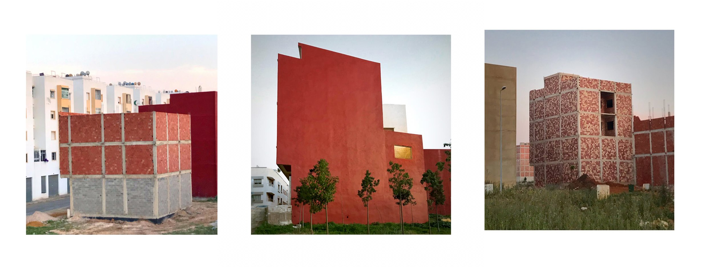

# MMM, Maison Marocaine Moderne.
- The work is constantly in progress.
- The Moroccan Modern House constitues 75% of the urban landscape in Morocco. These typologies are developped in a constant speed that it is almost impossible to trace their sprawl.
- The aim of this app is to work as a plateform, and a user interface to allow users to build their own MMM, and download it as PDF kit to be used for further input to gather data about such as; the ornaments, the colors, the internal plan compositions, and the aesthetics of the people that they would input via social media.
- This app is intended to host a grasshopper definition and serve as the API that client applications can call to have definitions solved with modified input parameters.

## Input Parameters
- **Change Height** 
- **Change Width**
- **Change Number of floors**
- **Number of Facades**
- **Plot Price per m²**
- **Shell Structure price per m²**
- **Interior Finishing price per m²**
- **Desired selling price per m²**

## Archives and documentation.
- Please visit our instagram page [instagram](https://www.instagram.com/mmmmmmmmmaison/)
- Website in Progress @ https://www.mmm.house

This was made during the course of Cloud Based Data Management @ IAAC, BIMSC21 
- Tutors: David Andrés León, Hesham Shawqy.

- Website for APP : https://maisonmarocainemoderne.herokuapp.com/examples/MMM_FINAL/
